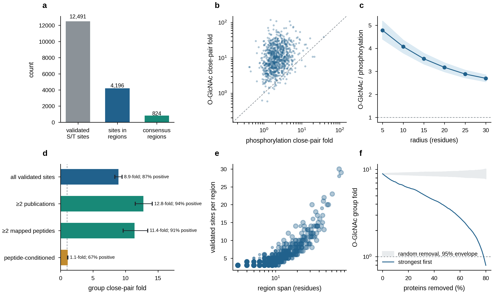

# Sweet spots

[](https://github.com/filiprumenovski/sweet-spots/releases/tag/v1.0.2)
[](https://www.python.org/)
[](https://snakemake.readthedocs.io/)
[](LICENSE)

Reproducible analyses for *Sweet spots: how a promiscuous glycosyltransferase
reads a conserved regional code*.

This repository rebuilds the consensus O-GlcNAc region catalogue, every
reported computational analysis, five main and three supplemental figures, a
machine-readable result ledger, and the terminal integrity audit. Retained
results are included for immediate inspection; the Snakemake workflow recreates
them from frozen inputs.

<p align="center">
  
</p>

## Quick start

Requirements are Python 3.12, [uv](https://docs.astral.sh/uv/), and a POSIX
shell. DuckDB, Snakemake, and all Python dependencies are pinned in `uv.lock`.

```bash
git clone https://github.com/filiprumenovski/sweet-spots.git
cd sweet-spots
make install
make inputs
```

`make inputs` downloads and verifies the 127 MB open-data release. Three
licensed inputs cannot be republished and must be supplied separately. Their
exact locations, versions, sizes, hashes, and provider links are listed in the
[input data guide](docs/input_data.md).

Once the complete `inputs/` tree is present:

```bash
make validate-inputs  # verify every input digest
make dry-run          # inspect the complete execution plan
make reproduce        # run all analyses, figures, tables, and audits
```

The workstation profile uses four cores and a 32 GB aggregate memory ceiling.
For larger systems, pass Snakemake options through `SNAKEMAKE_ARGS`:

```bash
make reproduce SNAKEMAKE_ARGS="--cores 16 --resources mem_mb=96000"
```

The included SLURM profile submits independent shards while respecting each
rule's declared CPU, memory, disk, and runtime requirements:

```bash
uv run snakemake --snakefile workflow/Snakefile --profile profiles/slurm
```

## Outputs

All generated products live below `results/`; source inputs are treated as
immutable.

| Product | Description |
|---|---|
| [`results/analysis/`](results/analysis/) | Transparent CSV and JSON output from each analysis |
| [`results/figures/`](results/figures/) | Vector PDF and 400 dpi PNG for every retained figure |
| [`results/tables/manuscript_result_ledger.parquet`](results/tables/manuscript_result_ledger.parquet) | One row per reported estimand, materialized with DuckDB |
| [`results/provenance/input_manifest.json`](results/provenance/input_manifest.json) | File hashes and directory-tree hashes for every frozen input |
| [`results/audit/reproduction_report.json`](results/audit/reproduction_report.json) | Final numerical and figure-integrity checks |

The retained audit reports `reproduced`; the figure manifest records the byte
size and SHA-256 digest of every rendered PDF and PNG.

## Reproducibility design

- Protein-grouped outer folds isolate model assessment from model selection and
  threshold calibration.
- Protein-level bootstrap and permutation procedures preserve the biological
  unit of inference.
- Expensive simulations, kinase scoring, and model fitting use deterministic
  map/reduce shards that can be resumed safely.
- Writers commit atomically; reducers reject missing shards, duplicate keys,
  schema drift, altered digests, and incomplete fold coverage.
- Figures consume declared workflow products rather than transcribed values.

Changing the number of shards changes scheduling, not record ownership, random
seeds, or numerical results. The full contract is described in the
[workflow architecture](docs/architecture.md).

## Repository map

```text
sweet-spots/
├── config/                 validated scientific and execution parameters
├── docs/                   data, methods, and architecture documentation
├── profiles/               local and SLURM execution profiles
├── results/                retained analyses, figures, tables, and audit
├── scripts/                input installation utilities
├── src/regional_code_paper/
│   ├── analysis/           scientific estimands
│   ├── core/               configuration, randomness, and atomic I/O
│   ├── execution/          restartable map/reduce commands
│   ├── models/             features and grouped predictive models
│   ├── reporting/          figures, manifests, ledgers, and audits
│   └── sql/                declarative DuckDB analyses
├── tests/unit/             focused numerical and workflow-contract tests
└── workflow/               Snakemake DAG and domain-specific rules
```

## Documentation

| Guide | Contents |
|---|---|
| [Input data](docs/input_data.md) | Frozen data contract, licenses, hashes, and installation |
| [Workflow architecture](docs/architecture.md) | Parallel execution, determinism, and failure behavior |
| [Clustering breadth](docs/clustering_breadth.md) | Estimands, conditioned null, and inferential guardrails |
| [Execution profiles](profiles/README.md) | Workstation and SLURM configuration |
| [Result archive](results/README.md) | Structure of the retained computational products |

## Development

```bash
make check
```

This runs Ruff, the unit test suite, and the lockfile consistency check. See
[CONTRIBUTING.md](CONTRIBUTING.md) for the review contract.

## Authors and affiliation

- **Filip Rumenovski** — lead author
- **Charlie Fehl** — principal investigator

Department of Chemistry, Wayne State University. See [AUTHORS.md](AUTHORS.md)
for the canonical project authorship record.

## Citation and license

Use the repository's `CITATION.cff` metadata or GitHub's **Cite this repository**
menu to cite this software release.

The analysis code is available under the [MIT License](LICENSE). Input data
retain the licenses and access conditions of their original providers; see the
[data provenance and licensing table](docs/input_data.md).
